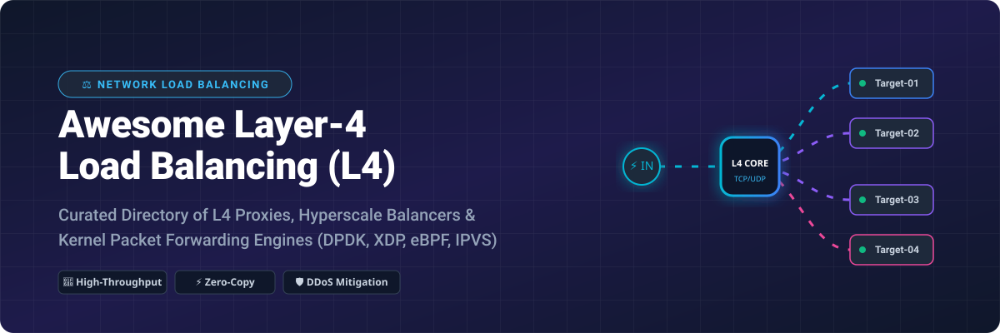

# Awesome-Network-Load-Balancing-L4

# Awesome-Network-Load-Balancing-L4

# Awesome-Network-Load-Balancing-L4 ⚖️ 🌐

  

  
  
  
  
  
  

---

## 🌟 Top Network Load Balancing (L4) Ecosystem

**Curated List of Commercial Load Balancers & Open-Source L4 Proxy Solutions**  
*Focused on Layer 4 (TCP/UDP) Load Balancing, High Availability, DDoS Mitigation & Kernel-Level Packet Forwarding*  

**Last updated: October 2026** 📅

---

### 📌 Overview & SEO Summary
Welcome to the ultimate curated directory of **Layer 4 network load balancing solutions**, **open-source TCP/UDP proxies**, and **kernel-level packet forwarding engines**. Whether you are looking for enterprise-grade commercial L4 load balancers (such as *AWS Network Load Balancer*, *Azure Load Balancer*, *Google Cloud Network Load Balancing*, and *F5 BIG-IP*), or high-performance open-source alternatives (like *HAProxy*, *Envoy Proxy*, *DPVS*, and *Seesaw*), this list covers category leaders, kernel bypass frameworks, and cloud-native ingress solutions.

---

## 📑 Table of Contents
- [🏢 SaaS & Commercial Platforms](#-saas--commercial-platforms)
- [🔓 Open-Source GitHub Projects](#-open-source-github-projects)
- [🛠️ How to Contribute](#%EF%B8%8F-how-to-contribute)
- [📊 Star History](#-star-history)
- [🤝 Support & Sponsorship](#-support--sponsorship)
- [⚠️ Disclaimer](#%EF%B8%8F-disclaimer)

---

## 🏢 SaaS / Commercial Platforms

The global L4 load balancing market is dominated by cloud hyperscalers offering elastic, consumption-based L4 services, alongside traditional ADC vendors providing high-throughput hardware appliances and virtual editions. Pricing models vary from per-hour resource charges plus data processing fees (Azure, AWS) to enterprise licensing with throughput caps (F5, Kemp, A10).

| SaaS / Commercial Platform | Company / Owner | Valuation / Market Cap | Standard Edition Starting Price | Free Tier / Free Trial Limits | Description |
| :--- | :--- | :--- | :--- | :--- | :--- |
| **[Azure Load Balancer](https://azure.microsoft.com/en-us/products/load-balancer/)** ☁️ | Microsoft | ~$3.8 Trillion | Standard: ~$0.025/hr + $0.005/GB processed; Basic: Free | Basic LB free (retired); Standard billed per rule-hour and data processed | **Cloud-native L4 load balancer** — ultra-low latency, TCP/UDP, zone-redundant, supports inbound NAT rules. |
| **[AWS Network Load Balancer](https://aws.amazon.com/elasticloadbalancing/network-load-balancer/)** 🌐 | Amazon | ~$2.0 Trillion | ~$0.0225/hr + NLCU charges (~$0.006/NLCU-hr) | No free tier; 12-month free tier available for some ELB features | **Hyper-scale L4 load balancer** — millions of requests/sec, static IP per AZ, preserves source IP, TLS offloading. |
| **[Google Cloud Network Load Balancing](https://cloud.google.com/load-balancing/docs/network)** 🔷 | Google (Alphabet) | ~$2.0 Trillion | Pay-as-you-go (forwarding rules + data processing) | $300 free credits for new customers; limited free tier for some networking | **Regional L4 load balancer** — supports TCP/UDP, external/internal, pass-through and proxy modes. |
| **[F5 BIG-IP](https://www.f5.com/products/big-ip-services)** 🏢 | F5 Networks | ~$10 Billion | BIG-IP VE: ~$3,812/yr (subscription); Hardware: $10K–$100K+ | 30-day trial available for VE; no permanent free tier | **Enterprise ADC** — advanced L4-L7, iRules scripting, SSL offload, DDoS protection, hardware acceleration. |
| **[Kemp LoadMaster](https://kemptechnologies.com/)** ⚙️ | Progress Software | ~$1.5 Billion | Virtual: ~$13,450 (1 Gbps license); Hardware: ~$27,480 | Free trial available; no permanent free tier | **Application delivery controller** — L4/L7 balancing, WAF, edge security, per-app licensing. |
| **[A10 Networks Thunder](https://www.a10networks.com/)** 🎛️ | A10 Networks | ~$500 Million | Hardware: ~$41,864 (Thunder 3350); VE licensing available | Trial available on request; no free tier | **High-performance ADC** — CGN, DDoS mitigation, SSL inspection, 800M concurrent sessions. |
| **[Snapt Nova](https://snapt.io/)** 🚀 | Snapt (Acquired) | Private | Free tier available; Paid from ~$99/mo | Free forever tier with limited usage; paid tier self-serve | **Cloud-native ADC** — L4/L7 load balancing, WAF, API gateway, supports multi-cloud deployments. |
| **[HAProxy Enterprise](https://www.haproxy.com/)** 🏎️ | HAProxy Technologies | Private | Enterprise: Custom licensing; Community: Free (open-source) | Community edition free; Enterprise 30-day trial | **High-performance L4/L7 proxy** — connection rate limiting, stick tables, seamless reload, advanced health checks. |
| **[NGINX Plus](https://www.nginx.com/products/nginx/)** 🟢 | F5 (Acquired NGINX) | ~$10 Billion | ~$2,500/yr per instance (estimated) | NGINX Open Source free; NGINX Plus 30-day trial | **L4/L7 load balancer** — `stream` module for TCP/UDP, round-robin, least connections, hash, health checks. |
| **[Envoy Proxy (Commercial Support)](https://www.envoyproxy.io/)** 🔵 | Solo.io / Tetrate | Private | Support contracts available | Envoy is open-source (Apache 2.0); commercial support via vendors | **Edge/service proxy** — L4 TCP proxy filter, cluster management, observability, dynamic configuration. |

---

## 🔓 Open-Source GitHub Projects

*Sorted by GitHub_Stars_Count (Descending)* 🌟

- **[Envoy Proxy](https://github.com/envoyproxy/envoy)**   
  **Cloud-native high-performance edge/middle/service proxy**, Apache-2.0 licensed. L4 `tcp_proxy` network filter with route matching, cluster management, and observability. The data plane for Istio and modern service meshes. ~26,651 stars [citation:22]. 🔷

- **[NGINX](https://github.com/nginx/nginx)**   
  **High-performance web server and reverse proxy**, BSD-2-Clause licensed. `stream` module provides L4 TCP/UDP load balancing with round-robin, least connections, hash, and random algorithms. ~31.6k stars [citation:19]. 🟢

- **[HAProxy](https://github.com/haproxy/haproxy)**   
  **The world's fastest and most widely used software load balancer**, GPL-2.0 licensed. L4 TCP/HTTP proxy with connection rate limiting, stick tables, seamless reload, and advanced health checking. ~6,750 stars [citation:9]. 🏆

- **[Seesaw](https://github.com/google/seesaw)**   
  **Linux Virtual Server (LVS) based load balancer**, Apache-2.0 licensed. Google's open-source L4 load balancer with health checking, Anycast support, and BGP integration. ~5,629 stars [citation:6]. 🔍

- **[DPVS](https://github.com/iqiyi/dpvs)**   
  **High-performance L4 load balancer based on DPDK**, GPL-2.0 licensed. Full-NAT mode, kernel bypass, millions of concurrent connections, supports IPVS-compatible APIs. Production-proven at iQiyi. ~3,085 stars [citation:27]. 🚀

- **[LVS (Linux Virtual Server)](http://www.linuxvirtualserver.org/)**   
  **Advanced IP load balancing inside the Linux kernel**, GPL-2.0 licensed. IPVS (IP Virtual Server) provides L4 NAT, DR (Direct Routing), and TUN tunneling modes for massive scalability. ~2k stars for Alibaba distribution [citation:4]. 🐧

- **[OpenELB](https://github.com/kubesphere/openelb)**   
  **Bare-metal load balancer for Kubernetes**, Apache-2.0 licensed. Supports BGP, ECMP, and L2 mode for exposing services outside Kubernetes clusters. ~1,719 stars [citation:25]. 🏗️

- **[kube-vip](https://github.com/kube-vip/kube-vip)**   
  **Virtual IP and load balancer for Kubernetes**, Apache-2.0 licensed. Provides L2 and BGP-based VIP management for control plane and services. ~1,153 stars [citation:31]. 🛠️

- **[gobetween](https://github.com/yyyar/gobetween)**   
  **Modern & minimalistic L4 load balancer**, MIT licensed. Written in Go, supports TCP, UDP, TLS termination, and multiple discovery backends (Consul, Etcd, DNS). Maintenance mode but production-proven [citation:40]. 🛣️

- **[nftlb](https://github.com/zevenet/nftlb)**   
  **nftables-based L4 load balancer**, AGPL-3.0 licensed. Supports DSR, DNAT, SNAT, IPv4/IPv6, TCP/UDP/SCTP balancing, and JSON API for live management. Packaged in SUSE Package Hub [citation:15]. 🔥

- **[arca-lb](https://github.com/akam1o/arca-lb)**   
  **VPP-based Layer 4 load balancing control plane for Kubernetes**, Apache-2.0 licensed. Declarative VIP management via Custom Resource, line-rate performance, OpenStack Octavia integration [citation:34]. ⚡

- **[Katran](https://github.com/facebookincubator/katran)**   
  **Facebook's L4 load balancer (XDP/eBPF)**, GPL-2.0 licensed. Kernel-level, high-performance, supports DSR (Direct Server Return), used in Facebook's edge infrastructure. 🛡️

- **[MetalLB](https://github.com/metallb/metallb)**   
  **Load balancer for bare-metal Kubernetes**, Apache-2.0 licensed. Provides L4 load balancing via ARP/NDP (L2) or BGP (BGP) for services of type `LoadBalancer`. 🛠️

- **[Pen](https://github.com/UlricE/pen)**   
  **Load balancer for TCP and UDP**, GPL-2.0 licensed. Simple, lightweight, supports source IP hashing, round-robin, and server health checks. 🖊️

- **[Keepalived](https://github.com/acassen/keepalived)**   
  **VRRP and LVS health checking**, GPL-2.0 licensed. Provides high availability for LVS/IPVS load balancers with VRRP failover and real server health checks. 🩺

- **[Trafik](https://github.com/traefik/traefik)**   
  **Cloud-native application proxy**, MIT licensed. Supports TCP and UDP routing alongside HTTP, with automatic service discovery and Let's Encrypt integration. 🚦

---

## 🛠️ How to Contribute

Contributions are welcome! Follow these steps to submit new L4 load balancing platforms or open-source proxy software:

1. 🍴 **Fork** the repository.
2. 📝 **Add/edit** entries in `README.md` maintaining table/list structure and formatting.
3. 🔗 Include project title, official website/GitHub link, exact Stars_Count, license, and brief description.
4. 🚀 Submit a **Pull Request** with a descriptive summary of your changes.

---

## 📊 Star History

---

## 🤝 Support & Sponsorship

If you find this network load balancing repository useful, please consider supporting the project:

- ⭐ **Star** this repository to increase visibility!
- 🔀 **Fork** and share with fellow developers & network engineers.
- ☕ **Sponsor & Buy Me a Coffee**: Support ongoing open-source curation via the [GitHub Sponsor Dashboard](https://github.com/sponsors/ishandutta2007).

---

## ⚠️ Disclaimer

- This is a **community-curated** list — not exhaustive and not an endorsement. ℹ️
- L4 load balancers sit in the critical path of production traffic. **Always test failover and health checking** before deploying to production. 🔒
- Open-source L4 solutions (HAProxy, Envoy, DPVS, Seesaw, nftlb) offer kernel-level performance and massive scalability, but enterprise-grade SLA guarantees, advanced DDoS mitigation, and vendor support remain primarily commercial offerings. ⚖️

---

  <b>Made with ❤️ for network engineers, SRE teams, and open-source infrastructure developers.</b>

